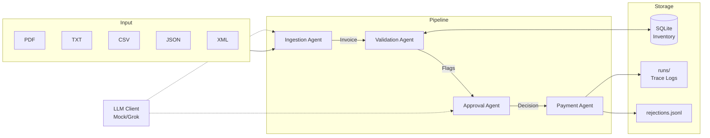

# Invoice Processing Automation

> A multi-agent system that automates end-to-end invoice processing, reducing manual effort and catching errors before payment.

## The Problem

Acme Corp loses **$2M/year** on manual invoice processing:
- **30% error rate** in data extraction
- **5-day processing delays** 
- Staff manually extract data, validate against inventory, chase VP approvals via email, then process payments

## The Solution

A four-stage automated pipeline that:

1. **Extracts** structured data from messy invoices (PDF, TXT, CSV, JSON, XML)
2. **Validates** against inventory database with fuzzy matching
3. **Approves** using rule-based logic + LLM reasoning with critique loops
4. **Processes** payment or logs rejection with full reasoning chain

## Quick Start

```bash
# Clone and install
git clone <repo>
cd galatiq-case-invoices
pip install -e ".[dev]"

# Initialize database
python -m src.main --init-db

# Process an invoice
python -m src.main --invoice_path data/invoices/invoice_1001.txt
```

**Run the UI:**
```bash
streamlit run src/ui/app.py
```

## Architecture



## What It Catches

| Scenario | Example | Detection |
|----------|---------|-----------|
| Unknown items | SuperGizmo, WidgetC | `UNKNOWN_ITEM` flag |
| Stock exceeded | Order 20, have 5 | `STOCK_EXCEEDED` flag |
| Zero stock items | FakeItem (0 in stock) | `ZERO_STOCK` flag |
| Negative quantities | qty: -5 | `NEGATIVE_QTY` flag |
| Fraud indicators | "URGENT wire transfer!" | `FRAUD_SUSPECT` flag |
| Blacklisted vendors | Fraudster LLC | `BLACKLISTED_VENDOR` flag |
| Missing data | Empty vendor name | `MISSING_VENDOR` flag |
| High value orders | >= $10,000 | Extra scrutiny applied |
| Foreign currency | EUR instead of USD | `NEEDS_HUMAN` escalation |
| Duplicate invoices | Already processed | `NEEDS_HUMAN` escalation |
| OCR typos | "Widget A" vs "WidgetA" | Fuzzy matching with flag |

## Test Results

**99 tests passing** covering all scenarios from the case study:

```
tests/test_models.py      14 passed   # Pydantic models
tests/test_db.py          19 passed   # Database queries  
tests/test_ingestion.py   12 passed   # File parsing
tests/test_validation.py  15 passed   # Validation flags
tests/test_approval.py    17 passed   # Approval logic
tests/test_payment.py      9 passed   # Payment processing
tests/test_pipeline.py    13 passed   # End-to-end scenarios
```

Run tests:
```bash
pytest tests/ -v
```

## LLM Backend

The system supports two backends:

| Backend | Usage | When to Use |
|---------|-------|-------------|
| **Mock** (default) | `LLM_BACKEND=mock` | Testing, demos, no API key |
| **Grok** | `LLM_BACKEND=grok` | Production with xAI API |

The mock client returns deterministic responses based on invoice content, making tests reproducible and fast (~2.7s for 99 tests).

To use Grok:
```bash
export XAI_API_KEY=your_key
export LLM_BACKEND=grok
python -m src.main --invoice_path data/invoices/invoice_1001.txt
```

## Project Structure

```
src/
  main.py              # CLI entrypoint
  models/              # Pydantic models (Invoice, ValidationResult, etc.)
  llm/                 # LLM client interface (Mock + Grok)
  db/                  # SQLite queries and seeding
  agents/
    ingestion.py       # PDF/TXT/CSV/JSON/XML extraction
    validation.py      # Inventory validation with fuzzy matching
    approval.py        # Rule-based + generator/critic loop
    payment.py         # Mock payment + rejection logging
  graph/
    pipeline.py        # Pipeline orchestration
  ui/
    app.py             # Streamlit UI
tests/                 # 99 tests covering all scenarios
data/invoices/         # Sample invoices (20 files)
runs/                  # Trace logs (JSON per run)
```

## Scope Decisions

**Included:**
- Full pipeline from ingestion to payment
- 13 validation flag types
- Fuzzy item matching (handles OCR errors)
- Generator/critic approval loop
- Structured JSON logging with traces
- Streamlit UI for demo
- Comprehensive test suite

**Deferred:**
- Real LangGraph integration (env dependency issues - using compatible SimplePipeline)
- Email ingestion (files only)
- Real payment API integration
- User authentication
- Webhook notifications

## What I'd Do Next

1. **LangGraph Migration** - Swap SimplePipeline for real LangGraph when env supports it
2. **Human Review Queue** - UI page for NEEDS_HUMAN invoices with approve/reject actions
3. **Batch Analytics** - Dashboard showing approval rates, common rejection reasons
4. **Vendor Learning** - Auto-adjust fuzzy matching based on confirmed matches
5. **Cost Tracking** - Log LLM token usage per run for cost optimization
6. **Webhook Integration** - Notify external systems on approval/rejection

## Demo Commands

```bash
# Clean invoice - should approve
python -m src.main --invoice_path data/invoices/invoice_1001.txt

# Stock exceeded - should reject
python -m src.main --invoice_path data/invoices/invoice_1002.txt

# Fraud indicators - should reject
python -m src.main --invoice_path data/invoices/invoice_1003.txt

# Negative quantity - should reject  
python -m src.main --invoice_path data/invoices/invoice_1009.json

# Unknown item - should reject
python -m src.main --invoice_path data/invoices/invoice_1016.json

# Batch process all
python -m src.main --invoice_path data/invoices/
```

## Sample Output

```
============================================================
INVOICE PROCESSING RESULT
============================================================

Run ID:         run-20260830-224002-ee3078
Source:         data/invoices/invoice_1001.txt
Invoice #:      INV-1001
Vendor:         Widgets Inc.
Total:          $5000.0

Validation Flags: None
Approval Status:  APPROVED
Payment Status:   success

Final Status: success
Duration: 13ms
============================================================
```

---

*Built for the Galatiq case study. See [CASE_STUDY.md](CASE_STUDY.md) for original requirements.*
